# Execution Plan - AWSomeShop

## Detailed Analysis Summary

### Project Context
- **Project Type**: Greenfield (全新项目)
- **Request Type**: New Project - 内部员工福利电商 MVP
- **Complexity**: Moderate - 多组件系统，中等复杂度
- **User Impact**: Direct - 员工和管理员直接使用

### Change Impact Assessment
- **User-facing changes**: Yes - 全新用户界面和交互流程
- **Structural changes**: Yes - 新建完整系统架构
- **Data model changes**: Yes - 新建数据库模型（User, Product, PointsTransaction, Redemption）
- **API changes**: Yes - 新建 RESTful API
- **NFR impact**: Yes - 性能、安全、可用性要求

### Risk Assessment
- **Risk Level**: Medium
- **Rollback Complexity**: Easy (全新系统，无现有依赖)
- **Testing Complexity**: Moderate (多角色、多功能模块)

---

## Workflow Visualization

```mermaid
flowchart TD
    Start(["User Request"])
    
    subgraph INCEPTION["🔵 INCEPTION PHASE"]
        WD["Workspace Detection<br/><b>COMPLETED</b>"]
        RE["Reverse Engineering<br/><b>SKIPPED</b>"]
        RA["Requirements Analysis<br/><b>COMPLETED</b>"]
        US["User Stories<br/><b>COMPLETED</b>"]
        WP["Workflow Planning<br/><b>IN PROGRESS</b>"]
        AD["Application Design<br/><b>EXECUTE</b>"]
        UG["Units Generation<br/><b>EXECUTE</b>"]
    end
    
    subgraph CONSTRUCTION["🟢 CONSTRUCTION PHASE"]
        FD["Functional Design<br/><b>EXECUTE</b>"]
        NFRA["NFR Requirements<br/><b>EXECUTE</b>"]
        NFRD["NFR Design<br/><b>EXECUTE</b>"]
        ID["Infrastructure Design<br/><b>EXECUTE</b>"]
        CG["Code Generation<br/><b>EXECUTE</b>"]
        BT["Build and Test<br/><b>EXECUTE</b>"]
    end
    
    subgraph OPERATIONS["🟡 OPERATIONS PHASE"]
        OPS["Operations<br/><b>PLACEHOLDER</b>"]
    end
    
    Start --> WD
    WD --> RA
    RA --> US
    US --> WP
    WP --> AD
    AD --> UG
    UG --> FD
    FD --> NFRA
    NFRA --> NFRD
    NFRD --> ID
    ID --> CG
    CG --> BT
    BT --> OPS
    OPS --> End(["Complete"])
    
    style WD fill:#4CAF50,stroke:#1B5E20,stroke-width:3px,color:#fff
    style RA fill:#4CAF50,stroke:#1B5E20,stroke-width:3px,color:#fff
    style US fill:#4CAF50,stroke:#1B5E20,stroke-width:3px,color:#fff
    style WP fill:#4CAF50,stroke:#1B5E20,stroke-width:3px,color:#fff
    style CG fill:#FFA726,stroke:#E65100,stroke-width:3px,stroke-dasharray: 5 5,color:#000
    style BT fill:#FFA726,stroke:#E65100,stroke-width:3px,stroke-dasharray: 5 5,color:#000
    style RE fill:#BDBDBD,stroke:#424242,stroke-width:2px,stroke-dasharray: 5 5,color:#000
    style AD fill:#FFA726,stroke:#E65100,stroke-width:3px,stroke-dasharray: 5 5,color:#000
    style UG fill:#FFA726,stroke:#E65100,stroke-width:3px,stroke-dasharray: 5 5,color:#000
    style FD fill:#FFA726,stroke:#E65100,stroke-width:3px,stroke-dasharray: 5 5,color:#000
    style NFRA fill:#FFA726,stroke:#E65100,stroke-width:3px,stroke-dasharray: 5 5,color:#000
    style NFRD fill:#FFA726,stroke:#E65100,stroke-width:3px,stroke-dasharray: 5 5,color:#000
    style ID fill:#FFA726,stroke:#E65100,stroke-width:3px,stroke-dasharray: 5 5,color:#000
    style OPS fill:#BDBDBD,stroke:#424242,stroke-width:2px,stroke-dasharray: 5 5,color:#000
    style INCEPTION fill:#BBDEFB,stroke:#1565C0,stroke-width:3px,color:#000
    style CONSTRUCTION fill:#C8E6C9,stroke:#2E7D32,stroke-width:3px,color:#000
    style OPERATIONS fill:#FFF59D,stroke:#F57F17,stroke-width:3px,color:#000
    style Start fill:#CE93D8,stroke:#6A1B9A,stroke-width:3px,color:#000
    style End fill:#CE93D8,stroke:#6A1B9A,stroke-width:3px,color:#000
    
    linkStyle default stroke:#333,stroke-width:2px
```

---

## Phases to Execute

### 🔵 INCEPTION PHASE
- [x] Workspace Detection - COMPLETED
- [x] Reverse Engineering - SKIPPED (Greenfield project)
- [x] Requirements Analysis - COMPLETED
- [x] User Stories - COMPLETED
- [x] Workflow Planning - IN PROGRESS
- [ ] Application Design - **EXECUTE**
  - **Rationale**: 需要定义组件架构（认证、产品、积分、兑换模块）和服务层设计
- [ ] Units Generation - **EXECUTE**
  - **Rationale**: 系统需要分解为多个工作单元（后端 API、前端 UI、数据库、AWS S3 集成）

### 🟢 CONSTRUCTION PHASE
- [ ] Functional Design - **EXECUTE** (per-unit)
  - **Rationale**: 需要详细设计数据模型、业务逻辑和 API 接口
- [ ] NFR Requirements - **EXECUTE** (per-unit)
  - **Rationale**: 需要确定性能、安全、可用性的具体实现方案
- [ ] NFR Design - **EXECUTE** (per-unit)
  - **Rationale**: 需要设计认证机制、密码加密、API 安全、S3 集成等
- [ ] Infrastructure Design - **EXECUTE** (per-unit)
  - **Rationale**: 需要设计 Docker/Kubernetes 部署架构、PostgreSQL 配置、AWS S3 设置
- [ ] Code Generation - **EXECUTE** (per-unit, ALWAYS)
  - **Rationale**: 实现所有功能代码
- [ ] Build and Test - **EXECUTE** (ALWAYS)
  - **Rationale**: 构建、测试和验证整个系统

### 🟡 OPERATIONS PHASE
- [ ] Operations - **PLACEHOLDER**
  - **Rationale**: 未来部署和监控工作流

---

## Estimated Timeline
- **Total Stages to Execute**: 11 stages
- **Estimated Duration**: 根据单元数量和复杂度确定

---

## Success Criteria
- **Primary Goal**: 构建可运行的 AWSomeShop MVP，验证积分兑换商业模式
- **Key Deliverables**:
  - 完整的前后端代码
  - 数据库模型和迁移脚本
  - Docker/Kubernetes 部署配置
  - AWS S3 集成
  - 单元测试和集成测试
- **Quality Gates**:
  - 所有用户故事的验收标准通过
  - 性能要求达标（< 2秒响应时间）
  - 安全要求满足（密码加密、API 认证、权限控制）
